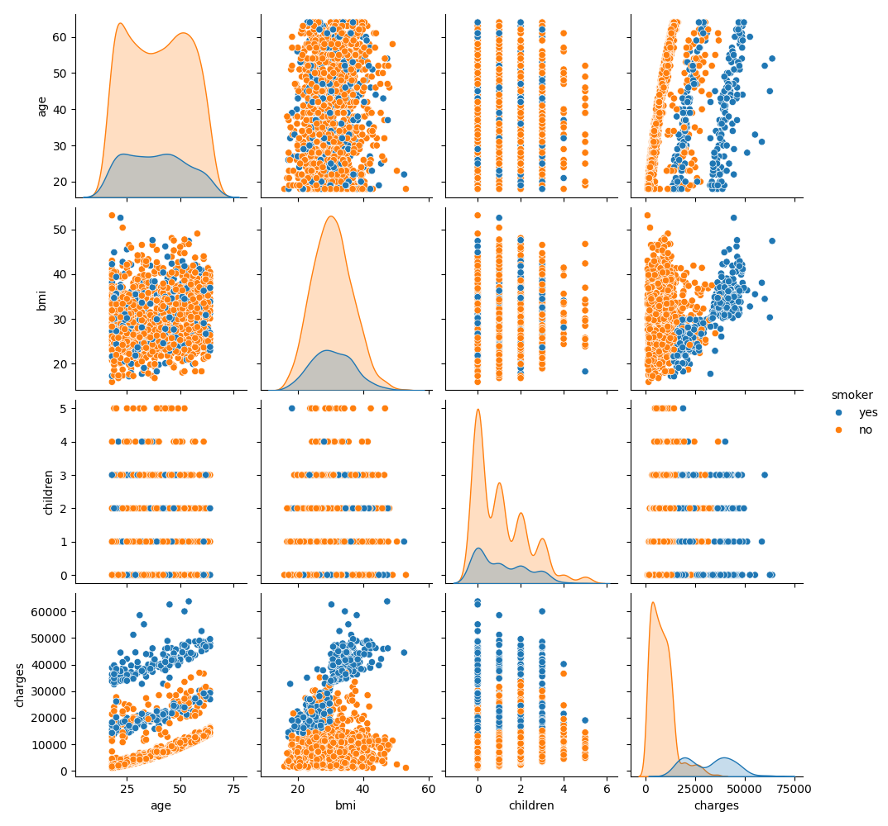

# Taller de Visualización de Datos - Dataset Seguros

Este taller cubre:
1. Carga y exploración de datos
2. Gráficas de distribución, asimetría y curtosis
3. Visualizaciones avanzadas: scatterplot, boxplot, pairplot, facetgrid
4. Filtrado por condición (`smoker == "yes"`)
5. Exportación de métricas a CSV

## Gráficas Generadas

## Archivo de métricas
El archivo `metricas_fumadores.csv` contiene estadísticas descriptivas para fumadores agrupadas por región y sexo.
